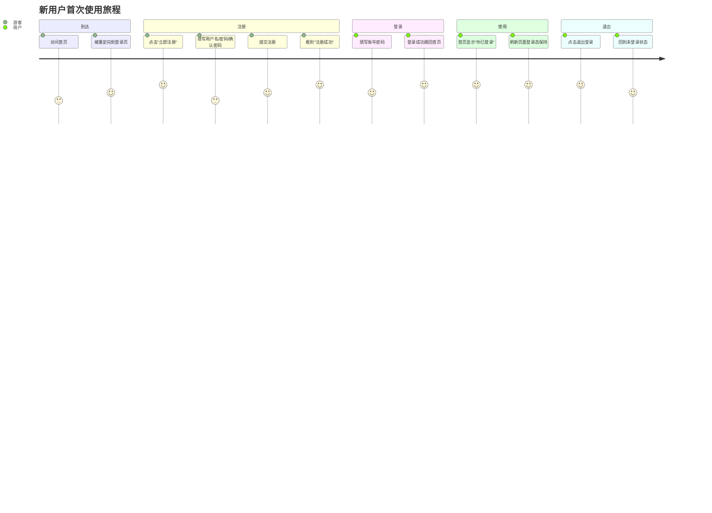
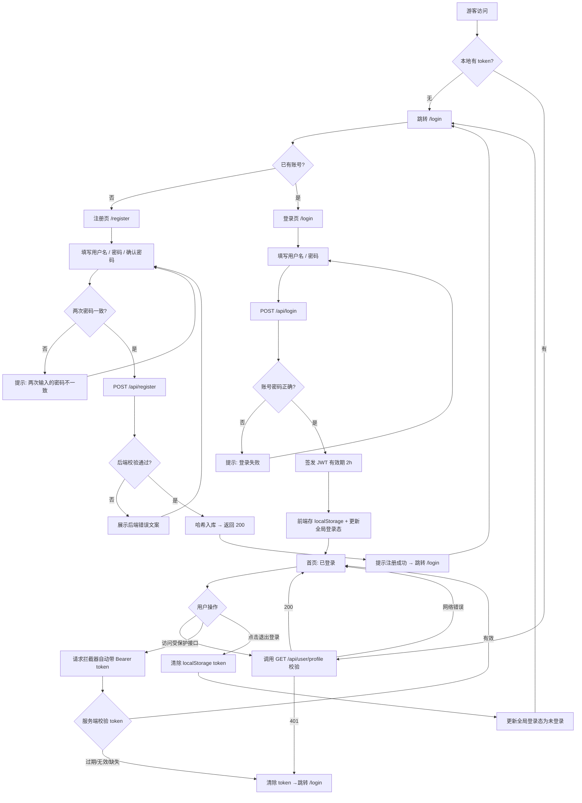
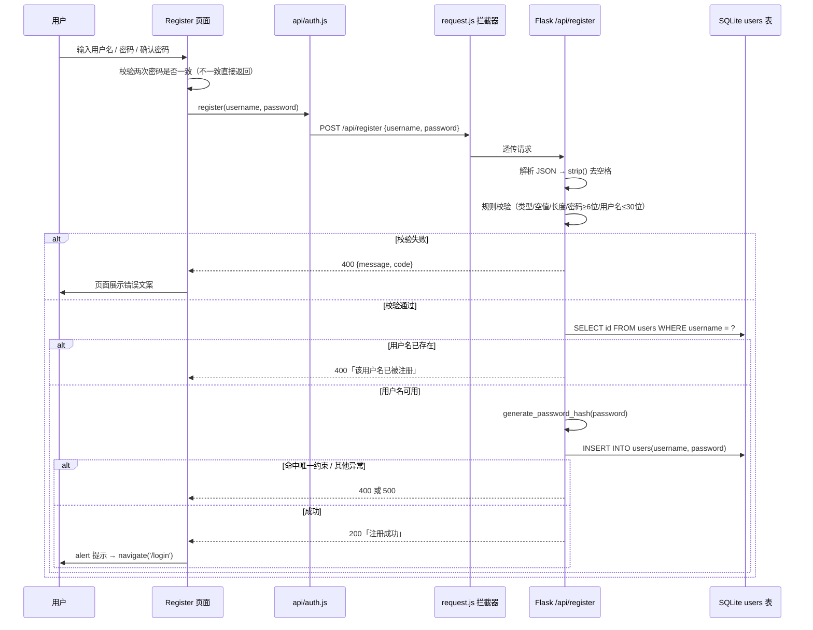
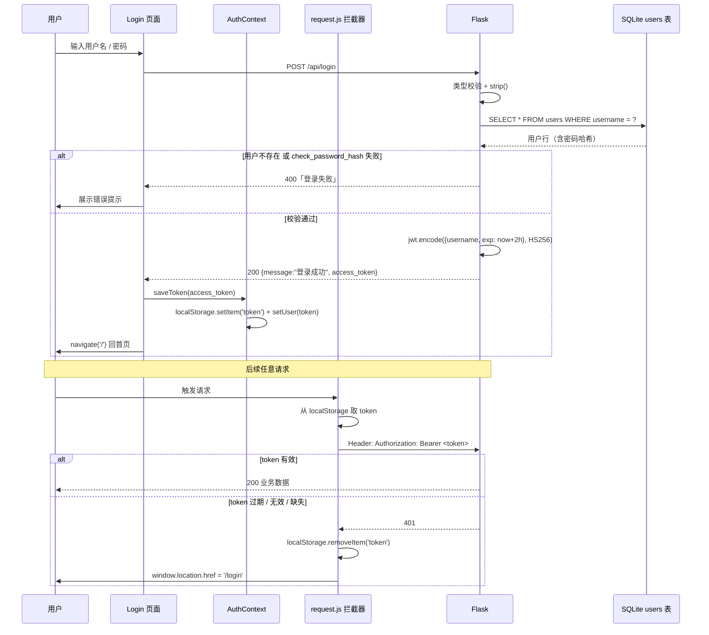

# auth-system 用户认证系统 产品需求文档（PRD）

> 文档状态：待评审
> 适用版本：v1.0.0

---

## 文档归属说明

| 项目 | 内容 |
| --- | --- |
| 所属项目 / 产品 | auth-system（用户认证系统），包含 `front`（React 19 + Vite 前端）与 `backend`（Flask + SQLite 服务端）两个子工程 |
| 依赖平台 / 上游 | 无强依赖。当前为独立闭环服务；预留 JWT 作为后续业务系统（如订单、个人中心）的统一鉴权底座 |
| 依赖技术栈 | 前端：React 19 / Vite / react-router-dom 7 / axios 1.19；后端：Flask + Flask-CORS / PyJWT（HS256）/ werkzeug.security / SQLite |
| 负责团队 / 成员 | 产品负责人：（待填）· 研发负责人：（待填）· 测试负责人：（待填） |
| 关联文档 | `docs/架构图/01_全项目交互总图.svg`、`02_登录token数据流.svg`、`03_注册数据流.svg`、`学习.md`、`backend/test_api.py` |
| 文档维护人 | （待填） |

---

## 版本变更记录

| 版本号 | 时间 | 变更内容描述 | 变更类型 | 变更人 |
| --- | --- | --- | --- | --- |
| v1.0.0 | 2026-09-17 | 首版：用户注册、用户登录、JWT 签发与校验、前端登录态保持与路由守卫 | 新增 | （待填） |
| v0.9.0 | — | 后端支持 SQLite 自动建表 + 密码哈希存储 | 新增 | （待填） |
| v0.5.0 | — | 前后端联调打通，统一响应结构 `{message, code}` | 优化 | （待填） |

---

# 一、需求背景及分析（为什么要做）

## 1.1 需求背景

### 1.1.1 需求来源

auth-system 是整个产品线的**基础能力层**。在它之前，任何业务模块（个人中心、订单、后台管理）如果要判断"这个人是谁、他能不能看这个数据"，都需要各自重复实现一遍账号校验逻辑，导致：

- **重复造轮子**：每个业务都要自己写一遍账号密码校验 + 登录态判断。
- **安全口径不统一**：有的模块存明文密码，有的模块自己拼 token，一旦出现漏洞需要全项目排查。
- **无统一身份标识**：后端接口无法在服务端确认"请求到底来自谁"，只能信任前端传来的 `username`，可被随意伪造。

### 1.1.2 行业 / 技术背景

- **行业侧**：主流 Web 产品的登录态方案已从「服务端 Session + Cookie」普遍演进为「**Token（JWT）无状态鉴权**」，原因是前后端分离、多端（PC / H5 / 小程序 / App）共用同一套后端接口时，Token 在跨域和跨端场景下更轻、更灵活。
- **技术侧**：
  - 后端选择 **Flask**，轻量、路由声明式（`@app.route`），适合作为能力底座的快速落地；
  - 前端选择 **React 19 + Vite + react-router-dom**，HMR 秒级反馈，组件化便于后续扩展；
  - 存储选择 **SQLite**，零运维成本、单文件（`backend/database.db`），适合作为一期底座，后续可平滑迁移至 MySQL / PostgreSQL。

### 1.1.3 数据与收益（目标量级）

| 指标维度 | 现状（无认证系统） | 目标（上线后） | 说明 |
| --- | --- | --- | --- |
| 覆盖用户 | 0（无账号体系，无法统计） | 一期覆盖全部 C 端访问用户 | 认证是所有用户进入业务的前提 |
| 接入业务模块 | 0 个统一入口 | 全部需要身份识别的模块零改造接入 | 复用同一套 `/api/*` 与 Token |
| 研发人效 | 每个模块重复实现约 1～2 人日 | 接入成本降至 **0.5 人日内** | 直接复用中间件与前端拦截器 |
| 安全等级 | 明文存储、无服务端校验 | 密码哈希存储 + 服务端 Token 校验 | 存量风险清零 |
| 稳定性 | — | 注册 / 登录接口成功率 **≥ 99.9%** | 以埋点与接口监控为准 |

**对研发团队的收益**：
1. 一次实现，全局复用，后续新业务只需在请求头带上 Token；
2. 统一错误码与响应结构（`{message, code}`），前后端联调成本显著下降；
3. 统一日志与异常出口，线上问题可定位。

---

## 1.2 产品目的

### 1.2.1 战略角度

- **定位**：auth-system 定位为公司产品的「**身份底座**」，不追求功能大而全，追求"稳定、安全、易接入"。
- **长远目标**：认证与业务解耦。未来无论是新增 Web 端、移动端还是第三方开放接口，全部复用同一套 Token 签发与校验机制，避免多套账号体系并存导致的数据割裂。
- **资源规划**：一期只做 **注册 / 登录 / 登录态校验** 三件事，把单点做扎实（校验规则、异常兜底、并发约束），二期再扩展角色权限、第三方登录、找回密码等。

### 1.2.2 产品角度

- **迭代思路**：先打通「注册 → 登录 → 拿到凭证 → 访问受保护资源 → 退出」的最短闭环，形成可复用的技术骨架。
- **竞品对齐**：主流 SaaS / 电商 / 内容平台在认证环节的共性设计为：
  - 用户名唯一约束；
  - 密码强度下限；
  - 登录凭证具备**有效期**；
  - 凭证过期后自动登出并引导重新登录。
  本项目全部对齐。
- **差异化优势**：本项目把「**边界条件的兜底**」当作一等公民而非事后补丁 —— 例如并发注册的场景由数据库唯一索引而非仅靠"先查后插"拦住；Token 过期由统一拦截器处理，业务页面无需感知。这让底座具备"被放心复用"的基础。

### 1.2.3 用户角度

| 用户类型 | 核心诉求 | 当前痛点 | 本需求的解法 |
| --- | --- | --- | --- |
| 新访客 | 快速创建账号 | 不清楚密码规则，反复失败 | 输入框直接提示「密码（至少 6 位）」，规则前置可见 |
| 老用户 | 稳定登录、不用反复登录 | 刷新页面后登录态丢失 | Token 落地 `localStorage`，刷新自动恢复 |
| 已登录用户 | 明确知道自己处于登录态 | 不知道自己"登没登" | 首页明确展示「✓ 你已登录」，并提供退出入口 |
| 误操作用户 | 输入错了能看懂错在哪 | 报错信息笼统（"操作失败"） | 后端返回具体原因，前端原样展示 |

**用户反馈机制**：上线后通过页面埋点（注册 / 登录成功率）+ 用户访谈收集体验问题，进入迭代队列。

---

## 1.3 用户故事地图

### 1.3.1 用户角色定义

| 角色 | 说明 | 当前版本权限 |
| --- | --- | --- |
| 游客（未登录用户） | 未持有有效 Token 的访问者 | 仅可访问登录页、注册页 |
| 已登录用户 | 持有有效 Token 的用户 | 可访问首页等受保护页面，可主动退出 |
| 系统（后端服务） | 负责签发与校验凭证 | 签发 Token、校验 Token、返回 401 |

> 一期**不区分业务角色**（如普通用户 / 管理员），无角色权限矩阵。

### 1.3.2 用户故事地图

| 阶段 | 发现 / 进入 | 注册 | 登录 | 使用 | 退出 |
| --- | --- | --- | --- | --- | --- |
| **用户活动** | 访问系统 | 创建账号 | 登录账号 | 访问受保护页面 | 结束会话 |
| **用户任务** | 打开首页 / 直达登录页 | 填用户名 → 填密码 → 确认密码 → 提交 | 填用户名 → 填密码 → 提交 | 查看登录状态 | 点「退出登录」 |
| **用户故事** | 作为游客，我希望访问系统时被引导到登录页，这样我知道该先做什么 | 作为新访客，我希望注册后自动跳转到登录页，这样我能立刻完成登录 | 作为老用户，我希望登录成功后立刻回到首页，这样我不用再多点一步 | 作为已登录用户，我希望刷新页面后登录态还在，这样我不用重复登录 | 作为已登录用户，我希望一键退出并清除凭证，这样在公共电脑上也能保证安全 |
| **异常故事** | — | 作为用户，两次密码输错时我希望立刻被提示，而不是提交后才报错 | 作为用户，凭证过期时希望被自动送回登录页，而不是卡在白屏 | 作为用户，我不希望页面上明文展示我的凭证 | — |
| **后端故事** | — | 作为服务端，我希望同一用户名无法重复注册，避免数据重复 | 作为服务端，我希望密码以哈希形式存储，避免拖库即明文 | 作为服务端，我希望无凭证请求受保护资源时返回 401 | — |

### 1.3.3 核心旅程（泳道）



---

# 二、需求概览（做什么）

## 2.1 需求目标

| 目标编号 | 目标描述 | 验收标准 | 期望实现时间 |
| --- | --- | --- | --- |
| G1 | 用户可创建账号 | 合法用户名+密码（≥6 位）注册返回 200「注册成功」，数据落库 | 一期 |
| G2 | 用户名全局唯一 | 重复用户名返回 400「该用户名已被注册」，且并发提交不会产生重复数据 | 一期 |
| G3 | 用户可登录并获取凭证 | 账号密码正确返回 200 与 `access_token`；错误返回 400「登录失败」 | 一期 |
| G4 | 凭证可校验且具备有效期 | 无 / 错 / 过期凭证访问受保护接口均返回 401，有效期 2 小时 | 一期 |
| G5 | 登录态可跨刷新保持 | 刷新页面后仍处于登录态，直至凭证过期或主动退出 | 一期 |
| G6 | 登录态可主动销毁 | 点击「退出登录」清除本地凭证并回到未登录态 | 一期 |

---

## 2.2 需求范围

| 终端 | 版本号 | 期望上线时间 | 是否需要走查 |
| --- | --- | --- | --- |
| WEB（PC 浏览器） | v1.0.0 | 待定（评审后确定） | 是 |
| PC 客户端 | — | 本期不支持 | — |
| APP（iOS / Android） | — | 本期不支持 | — |
| 小程序 | — | 本期不支持 | — |

**浏览器兼容范围**：Chrome / Edge / Safari 最新两个大版本（依赖 `localStorage`、`fetch`/`XHR`、CSS Grid 等现代特性）。
**响应式**：一期以移动端优先的窄屏布局为主（`.auth-page` 单列卡片），PC 端居中展示。

---

## 2.3 需求清单

### 产品模块 1：用户注册

**功能点罗列**：
1. 注册表单：用户名、密码、确认密码三个输入项；
2. 前端一致性校验：两次密码不一致时**不发请求**，直接提示「两次输入的密码不一致」；
3. 提交注册：调用 `POST /api/register`；
4. 注册成功：弹出提示「注册成功！请登录」并自动跳转登录页；
5. 注册失败：在页面上以错误文案展示后端返回的具体原因。

**数据加工逻辑或存储要求**：
- 存储介质：SQLite，文件固定为 `backend/database.db`（与启动目录无关）；
- 表结构：

| 字段 | 类型 | 约束 | 说明 |
| --- | --- | --- | --- |
| `id` | INTEGER | PRIMARY KEY AUTOINCREMENT | 用户唯一自增 ID |
| `username` | TEXT | NOT NULL UNIQUE | 用户名 |
| `password` | TEXT | NOT NULL | **哈希后**的密码（禁止明文） |

- 唯一约束：除建表 UNIQUE 外，额外创建唯一索引 `idx_users_username`，兼容历史遗留表；
- 写入前处理：`username`、`password` 均执行 `strip()` 去除首尾空格（与登录侧规则严格一致）；
- 密码哈希：`werkzeug.security.generate_password_hash`；
- 启动时自动建表（`init_db()`），无需手动 DDL。

**算法要求和期望**：无算法要求。

**策略规则（校验规则表）**：

| 序号 | 规则 | 校验位置 | 失败返回 |
| --- | --- | --- | --- |
| R1 | 请求体必须是合法 JSON 对象 | 后端 | 400「请求内容不能为空，请传入JSON数据」 |
| R2 | 用户名和密码必须为字符串类型 | 后端 | 400「用户名和密码格式不正确」 |
| R3 | 用户名去除空格后不能为空 | 后端 | 400「用户名不能为空」 |
| R4 | 密码不能为空 | 后端 | 400「密码不能为空」 |
| R5 | 密码长度 ≥ 6 位 | 后端 | 400「密码长度不能少于 6 位」 |
| R6 | 用户名长度 ≤ 30 位 | 后端 | 400「用户名长度不能超过 30 位」 |
| R7 | 用户名不可重复（先查 + 数据库唯一约束双保险） | 后端 | 400「该用户名已被注册」 |
| R8 | 两次密码必须一致 | 前端 | 页面提示「两次输入的密码不一致」 |
| R9 | 服务端异常不泄露内部信息 | 后端 | 500「注册失败，请稍后重试」 |

---

### 产品模块 2：用户登录与会话

**功能点罗列**：
1. 登录表单：用户名、密码两个输入项；
2. 提交登录：调用 `POST /api/login`；
3. 登录成功：拿到 `access_token` → 写入 `localStorage` → 更新全局登录态 → 跳回首页；
4. 登录失败：展示后端返回原因（统一为「登录失败」，不区分"用户不存在/密码错误"以避免账号枚举）；
5. 登录态保持：应用启动时若本地存在 Token，则调用 `GET /api/user/profile` 校验，仅在明确返回 **401** 时登出（网络异常不下线）；
6. 退出登录：清除 `localStorage` 中的 Token 并更新全局状态；
7. 凭证自动携带：所有请求经 axios 请求拦截器自动附加 `Authorization: Bearer <token>`；
8. 凭证失效兜底：响应拦截器捕获 401，统一清除本地 Token 并跳转 `/login`。

**数据加工逻辑或存储要求**：

- Token 载荷（payload）：

| 字段 | 含义 | 规则 |
| --- | --- | --- |
| `username` | 当前登录用户标识 | 与注册用户名一致 |
| `exp` | 过期时间 | 签发时刻 + **2 小时**（UTC） |

- 签名算法：`HS256`；密钥来自环境变量 `AUTH_SECRET_KEY`，未配置时使用开发默认值（**上线必须替换**）；
- 客户端存储：`localStorage` 的 `token` 键；不落 Cookie，不做明文渲染；
- 密码比对：`check_password_hash`，比对的是数据库中的哈希值，**不比对明文**。

**算法要求和期望**：无算法要求。

**策略规则（接口契约）**：

| 接口 | 方法 | 入参 | 成功 | 失败 |
| --- | --- | --- | --- | --- |
| `/api/register` | POST | `{username, password}` | 200 `{message:"注册成功", code:200}` | 400 校验/重复；500「注册失败，请稍后重试」 |
| `/api/login` | POST | `{username, password}` | 200 `{message:"登录成功", code:200, access_token}` | 400「登录失败」 |
| `/api/user/profile` | GET | Header `Authorization: Bearer <token>` | 200 `{message:"成功获取 xx 的个人信息", code:200}` | 401「缺少有效通行证 / 通行证已过期 / 无效的通行证」 |

---

### 产品模块 3：页面路由与访问控制

**功能点罗列**：
1. 路由表：`/login` 登录页、`/register` 注册页、`/` 首页（需登录）、`*` 兜底回首页；
2. 守卫一 `RequireAuth`：未登录访问 `/` → 重定向到 `/login`；
3. 守卫二 `RedirectIfAuthed`：已登录访问 `/login`、`/register` → 重定向到 `/`；
4. 重定向使用 `replace` 语义，避免"后退又回到被拦截页面"的死循环；
5. 首页双态展示：已登录展示头像图标 +「✓ 你已登录」+ 退出按钮；未登录展示「你还没有登录」+ 去登录入口。

**数据加工逻辑或存储要求**：无独立存储，登录态来源为 `AuthContext`。

**算法要求和期望**：无。

**策略规则**：页面访问权限矩阵如下。

| 页面路径 | 游客 | 已登录用户 |
| --- | --- | --- |
| `/`（首页） | ❌ 重定向到 `/login` | ✅ |
| `/login` | ✅ | ❌ 重定向到 `/` |
| `/register` | ✅ | ❌ 重定向到 `/` |
| 其他任意路径 | 重定向到 `/`，再按上述规则处理 | 同左 |

---

### 埋点需求 / 数据分析需求

| 埋点事件触发条件或场景 | 埋点事件名称 | 埋点事件属性及值 |
| --- | --- | --- |
| 进入登录页 | `page_view_login` | `source`（direct / redirect_from_home / logout） |
| 进入注册页 | `page_view_register` | `source`（direct / from_login） |
| 点击注册提交 | `click_register_submit` | `username_len`（数字）、`pwd_len`（数字） |
| 注册接口返回 | `register_result` | `result`（success / fail）、`fail_code`（400/500）、`fail_reason`（校验文案） |
| 点击登录提交 | `click_login_submit` | `username_len` |
| 登录接口返回 | `login_result` | `result`（success / fail）、`fail_code`、`duration_ms` |
| 登录成功 | `login_success` | `token_exp_hours`（2） |
| 刷新页面后校验凭证 | `token_verify` | `result`（valid / invalid_401 / network_error）、`trigger`（app_mount） |
| 凭证失效自动跳转 | `auth_redirect_login` | `reason`（401 / require_auth） |
| 点击退出登录 | `click_logout` | `session_duration_ms`（登录到退出的时长） |
| 首页访问 | `page_view_home` | `is_logged_in`（true / false） |

**实现后需要分析的数据指标**：

| 指标 | 口径 | 拆分维度 |
| --- | --- | --- |
| 注册转化率 | 注册成功数 / 注册页 PV | 日 / 周 / 月；按失败原因 |
| 注册失败 TOP 原因 | 各 `fail_reason` 占比 | 按 `fail_reason` 降序 |
| 登录成功率 | `login_result=success` / `click_login_submit` | 日 / 周；按用户 |
| 登录耗时 | `duration_ms` P50 / P95 | 日 / 周 |
| 注册→登录转化率 | `login_success` 用户数 / 注册成功用户数 | 按次、按用户 |
| 登录态留存 | 次日/7 日内再次 `login_success` 的用户占比 | 日 / 周 / 月 |
| 会话时长 | `session_duration_ms` 均值 / 分布 | 按用户 |
| 401 触发率 | `token_verify` 中 `invalid_401` 占比 | 日 / 周 |
| 退出率 | `click_logout` / `login_success` | 日 / 周 |

**GTM 策略**：见第五章。

---

## 2.4 管理预期与协调资源

| 事项 | 说明 |
| --- | --- |
| 关键依赖 | 后端服务需部署在可被前端访问的地址；前端 `request.js` 中的 `baseURL` 需随环境切换（一期为 `http://127.0.0.1:5000`） |
| 上线前置条件 | 生产环境必须设置 `AUTH_SECRET_KEY` 环境变量，禁止使用开发默认密钥 |
| 资源需求 | 前端 1 人、后端 1 人、测试 0.5 人 |
| 预期管理 | 一期**不包含**：找回密码、第三方登录、角色权限、多端登录互踢；这些属于二期范围 |

---

# 三、需求说明（具体怎么做）

## 3.1 需求功能流程图

### 3.1.1 总流程（注册 → 登录 → 鉴权 → 退出，含前向后向闭环）



### 3.1.2 注册时序图



### 3.1.3 登录与鉴权时序图



---

## 3.2 功能 1：用户注册

### 3.2.1 功能权限区分

| 用户 / 角色 | 是否可访问注册页 | 识别标准 |
| --- | --- | --- |
| 游客（无 Token） | ✅ 可访问 | `AuthContext.user` 为空 |
| 已登录用户 | ❌ 重定向到首页 `/` | `AuthContext.user` 有值（由 `RedirectIfAuthed` 判定） |

> 权限识别标准：**是否存在本地登录凭证**（`localStorage.token` 在应用初始化时被读入 `AuthContext.user`）。注意这是**前端体验层面的拦截**；真正的安全边界在后端接口，不依赖前端。

### 3.2.2 功能入口

| 入口 | 位置 | 说明 |
| --- | --- | --- |
| 主入口 | 登录页底部「还没有账号？**立即注册**」链接 | 跳转 `/register` |
| 间接入口 | 访问首页 `/` 时未登录 → 被重定向到 `/login` → 点击"立即注册" | 完整链路 |
| 直达入口 | 浏览器地址栏直接访问 `/register` | 游客可直接进入 |

**页面结构（原型示意）**：

```
┌──────────────────────────────┐
│  [登] 登录系统                │   ← brand 区（Logo + 品牌名）
│                              │
│  注册                         │   ← h2 标题
│  创建你的账户                  │   ← 副标题
│                              │
│  ⚠ 错误提示区（有错误时才出现） │   ← .error
│                              │
│  ┌────────────────────────┐  │
│  │ 用户名                  │  │   ← input[type=text]
│  └────────────────────────┘  │
│  ┌────────────────────────┐  │
│  │ 密码（至少 6 位）        │  │   ← input[type=password]
│  └────────────────────────┘  │
│  ┌────────────────────────┐  │
│  │ 确认密码                │  │   ← input[type=password]
│  └────────────────────────┘  │
│  ┌────────────────────────┐  │
│  │         注册           │  │   ← submit 按钮
│  └────────────────────────┘  │
│                              │
│  已有账号？ 去登录             │   ← 跳转登录页
└──────────────────────────────┘
```

**新功能引导**：无（首次即主路径，无需额外引导）。

### 3.2.3 功能界面信息与展示

| 展示元素 | 字段 / 文案 | 数据来源 | 展示转换 |
| --- | --- | --- | --- |
| 品牌 Logo | `登` | 前端硬编码 | 无 |
| 品牌名 | `登录系统` | 前端硬编码 | 无 |
| 标题 | `注册` | 前端硬编码 | 无 |
| 副标题 | `创建你的账户` | 前端硬编码 | 无 |
| 用户名输入框 | placeholder `用户名` | 前端硬编码 | 无 |
| 密码输入框 | placeholder `密码（至少 6 位）` | 前端硬编码 | **规则前置提示**：把后端 R5 规则提前暴露给用户 |
| 确认密码输入框 | placeholder `确认密码` | 前端硬编码 | 无 |
| 错误提示 | 后端 `message` | `POST /api/register` 响应体 | 直接展示，无二次加工 |
| 提交按钮 | `注册` | 前端硬编码 | 提交中不额外禁用（见 7. 已知限制） |

**终端差异**：本模块仅 WEB 端，采用移动端优先的单列卡片布局，PC 端水平居中。

### 3.2.4 用户交互操作

| 操作 | 类型 | 操作范围 | 操作后现象 | 数据变化 | 潜在条件 / 需兼顾的信息 |
| --- | --- | --- | --- | --- | --- |
| 输入用户名 | 增（本地状态） | 单个 | 输入框回显 | 前端 `username` state 变化 | 提交时后端 `strip()` 处理首尾空格 |
| 输入密码 | 增（本地状态） | 单个 | 密码以圆点回显 | 前端 `password` state 变化 | 提交时后端 `strip()`；长度 ≥ 6 |
| 输入确认密码 | 增（本地状态） | 单个 | 密码以圆点回显 | 前端 `confirm` state 变化 | 仅前端比对，不传后端 |
| 点击「注册」 | 查 + 增 | 单个 | 见下方分支 | 见下方分支 | 需拦截表单默认刷新行为 |
| 点击「去登录」 | 跳转 | — | 跳到 `/login` | 无 | 已登录用户会被 `RedirectIfAuthed` 弹回首页 |

**点击「注册」后的分支：**

| 分支 | 触发条件 | 页面现象 | 数据变化 |
| --- | --- | --- | --- |
| ① 前端校验失败 | 两次密码不一致 | 页面出现「两次输入的密码不一致」 | **不发请求**，无数据变化 |
| ② 前端校验通过 | 两次密码一致 | 发起 `POST /api/register` | 请求中 |
| ③ 后端校验失败 | 命中 R1～R6 任一 | 展示具体错误文案（如「密码长度不能少于 6 位」） | 数据库无变化 |
| ④ 用户名重复 | 命中 R7 | 展示「该用户名已被注册」 | 数据库无新增 |
| ⑤ 服务端异常 | 命中 R9 | 展示「注册失败，请稍后重试」 | 数据库无新增；后端日志留痕 |
| ⑥ 注册成功 | 全部通过 | 弹出「注册成功！请登录」→ 自动跳转 `/login` | `users` 表新增 1 行，密码字段为哈希值 |

**交互边界说明**：
- 提交前先 `setError('')` 清空上一次的错误提示，避免旧错误残留造成误导；
- 注册接口成功后**不自动登录**，需用户主动登录一次，确保用户记住密码。

---

## 3.3 功能 2：用户登录

### 3.3.1 功能权限区分

| 用户 / 角色 | 是否可访问登录页 | 识别标准 |
| --- | --- | --- |
| 游客（无 Token） | ✅ 可访问 | `AuthContext.user` 为空 |
| 已登录用户 | ❌ 重定向到首页 `/` | `AuthContext.user` 有值 |

### 3.3.2 功能入口

| 入口 | 位置 | 说明 |
| --- | --- | --- |
| 主入口 | 注册成功后的自动跳转 | 注册闭环 |
| 主入口 | 注册页底部「已有账号？**去登录**」 | 跳转 `/login` |
| 被动入口 | 未登录访问 `/` 被守卫重定向 | `RequireAuth` |
| 被动入口 | 任意请求返回 401 时被拦截器重定向 | 响应拦截器统一处理 |
| 直达入口 | 浏览器地址栏直接访问 `/login` | 游客可进入 |

### 3.3.3 功能界面信息与展示

| 展示元素 | 字段 / 文案 | 数据来源 | 展示转换 |
| --- | --- | --- | --- |
| 品牌区 | `登` + `登录系统` | 前端硬编码 | 无 |
| 标题 / 副标题 | `登录` / `登录你的账户以继续` | 前端硬编码 | 无 |
| 用户名输入框 | placeholder `用户名` | 前端硬编码 | 无 |
| 密码输入框 | placeholder `密码` | 前端硬编码 | 无 |
| 错误提示 | 后端 `message` | `POST /api/login` 响应体 | 直接展示；兜底文案「登录失败，请重试」 |
| 提交按钮 | `登录` | 前端硬编码 | 无 |
| 去注册入口 | `还没有账号？立即注册` | 前端硬编码 | 无 |

> ⚠️ **安全展示要求**：登录成功后**不得将 Token 明文渲染到页面**上，避免被截图或分享泄露。首页仅展示"登录凭证已安全保存（不展示具体内容）"。

### 3.3.4 用户交互操作

| 操作 | 类型 | 范围 | 操作后现象 | 数据变化 |
| --- | --- | --- | --- | --- |
| 输入账号 / 密码 | 增（本地状态） | 单个 | 输入框回显 | 前端 state |
| 点击「登录」 | 查 + 写入本地凭证 | 单个 | 见下方分支 | 成功后本地新增 Token |
| 点击「立即注册」 | 跳转 | — | 跳 `/register` | 无 |

**点击「登录」后的分支：**

| 分支 | 触发条件 | 页面现象 | 数据变化 |
| --- | --- | --- | --- |
| ① 请求体非法 | 非 JSON 对象 | 「请求内容不能为空，请传入JSON数据」 | 无 |
| ② 类型非法 | 账号或密码非字符串 | 「用户名和密码格式不正确」 | 无 |
| ③ 账号或密码错误 | 查无此人 或 哈希比对失败 | 「登录失败」 | 无（**不区分具体是账号还是密码错，防账号枚举**） |
| ④ 登录成功 | 哈希比对通过 | 跳转首页，展示"你已登录" | `localStorage.token` 写入；全局登录态更新 |
| ⑤ 网络异常 | 后端未启动 / 超时（>10s） | 「登录失败，请重试」 | 无 |

**登录成功后的连锁变化（重要）**：

| 变化点 | 内容 |
| --- | --- |
| 本地存储 | `localStorage.token = <JWT>` |
| 内存状态 | `AuthContext.user = <JWT>`，全应用组件感知 |
| 页面路由 | `navigate('/')` → 首页 |
| 后续请求 | 请求拦截器自动附加 `Authorization: Bearer <token>` |
| 凭证有效期 | 2 小时，到期后自动失效 |

---

## 3.4 功能 3：登录态保持与访问控制

### 3.4.1 功能权限区分

权限识别的唯一标准是 `AuthContext.user` 是否有值，而它的初始值来自 `localStorage.token`。因此：

1. **首次进入 / 刷新页面**：从 `localStorage` 读 Token 作为初始登录态（**乐观策略**，先认为已登录，避免首屏闪烁）；
2. **随后异步校验**：调用 `GET /api/user/profile` 确认 Token 是否真的有效；
3. **校验结果处理**：
   - 返回 200 → 保持登录态；
   - 返回 401 → `logout()` 清除凭证，页面自动回到未登录；
   - **网络错误 → 不下线**（避免后端临时不可用把用户全部踢出）。

### 3.4.2 功能入口

| 入口 | 位置 | 说明 |
| --- | --- | --- |
| 路由守卫 | `App.jsx` 中的 `RequireAuth` / `RedirectIfAuthed` | 页面级拦截 |
| 退出按钮 | 首页已登录态下的「退出登录」按钮 | 主动销毁会话 |
| 未登录态提示 | 首页未登录态「你还没有登录」+「去登录」 | 引导登录 |

### 3.4.3 功能界面信息与展示

| 登录态 | 展示内容 |
| --- | --- |
| 已登录 | 👤 头像图标 →「✓ 你已登录」→「登录状态已保存，刷新页面也不会丢失」→「登录凭证已安全保存（不展示具体内容）」→「退出登录」按钮 |
| 未登录 | 「你还没有登录」→「登录后即可使用全部功能」→「去登录」链接 |

### 3.4.4 用户交互操作

| 操作 | 类型 | 操作后现象 | 数据变化 |
| --- | --- | --- | --- |
| 刷新页面 | 读 | 已登录用户仍是已登录态（校验通过时） | 无 |
| 点击「退出登录」 | 删 | 首页立即变为未登录态 | 删除 `localStorage.token`；`AuthContext.user = null` |
| 访问 `/`（未登录） | 跳转 | 重定向到 `/login`（replace，不留历史记录） | 无 |
| 访问 `/login`（已登录） | 跳转 | 重定向到 `/` | 无 |
| 访问任意未知路径 | 跳转 | 回到 `/`，再按登录态分流 | 无 |
| 请求返回 401 | 自动处理 | 清除凭证 → 跳 `/login` | 删除 `localStorage.token` |

---

## 3.5 功能 4：受保护资源访问（凭证校验）

### 3.5.1 功能权限区分

| 请求携带的凭证 | 后端行为 | 返回 |
| --- | --- | --- |
| 无 `Authorization` 头 | 拒绝 | 401「缺少有效通行证」 |
| 头存在但非 `Bearer ` 前缀 | 拒绝 | 401「缺少有效通行证」 |
| `Bearer <过期 token>` | 拒绝 | 401「通行证已过期」 |
| `Bearer <伪造/篡改 token>` | 拒绝 | 401「无效的通行证」 |
| `Bearer <有效 token>` | 放行 | 200 + 用户信息 |

### 3.5.2 功能入口

该能力**无用户可见入口**，由前端请求拦截器自动附加凭证、后端 `verify_request_token()` 自动校验，属于"无感能力"。

### 3.5.3 功能界面信息与展示

无可视界面。凭证不落页面、不落日志、不在错误提示中回显。

---

## 3.6 数据加工说明

本模块**不涉及** BI、画像类重度数据加工，故无独立加工链路。相关数据仅做基础落库与后续埋点分析：

| 数据项 | 存储位置 | 口径 |
| --- | --- | --- |
| 用户账号 | SQLite `users` 表 | 原始值，写入前 `strip()` 去首尾空格 |
| 用户密码 | SQLite `users` 表 `password` 字段 | **单向哈希**，不可逆，不可反查 |
| 登录凭证 | 客户端 `localStorage` | JWT（含 `username`、`exp`），服务端不存储 |
| 接口耗时 | 待接入埋点 | `duration_ms`，前端计时 |

**时效性要求**：注册写入需实时生效（用户注册后立即可登录）。

---

## 3.7 算法逻辑、策略规则说明

### 3.7.1 策略规则一：注册输入校验策略

| 项 | 内容 |
| --- | --- |
| 目的 | 在数据入库前拦截非法输入，保证落库数据的完整性与一致性 |
| 数据来源 / 对象 | 用户输入：`username`、`password` |
| 处理逻辑 | 顺序执行：类型校验 → 去空格 → 非空校验 → 密码长度 ≥ 6 → 用户名长度 ≤ 30 → 用户名唯一性 → 哈希 → 入库 |
| 输出结果要求 | 任一规则不通过则返回 400 与明确文案；全部通过则返回 200 |
| 处理约束 | 单一接口无频次限制（一期未做限流） |

### 3.7.2 策略规则二：密码存储策略

| 项 | 内容 |
| --- | --- |
| 目的 | 防止数据库泄露导致用户密码明文外泄 |
| 数据来源 / 对象 | 用户输入的明文密码 |
| 处理逻辑 | 使用 `werkzeug.security.generate_password_hash` 单向哈希后存储；校验时用 `check_password_hash` 比对，**不回解原密码** |
| 输出结果要求 | 数据库中任何位置不出现明文密码 |
| 处理约束 | 加盐由 werkzeug 内部完成，同一密码每次哈希结果不同 |

### 3.7.3 策略规则三：凭证签发与校验策略

| 项 | 内容 |
| --- | --- |
| 目的 | 让服务端在无状态的前提下识别请求者身份，并对凭证的有效期做出约束 |
| 数据来源 / 对象 | 登录成功的用户名 + 签发时间 |
| 处理逻辑 | `jwt.encode({username, exp: now + 2h}, SECRET_KEY, HS256)`；校验时 `jwt.decode(token, SECRET_KEY, ["HS256"])`，分别捕获过期异常与无效异常 |
| 输出结果要求 | 有效凭证可访问受保护接口；过期/伪造凭证一律 401 |
| 处理约束 | 密钥必须具备足够长度（≥32 字节），且**生产环境必须通过 `AUTH_SECRET_KEY` 环境变量注入**，禁止使用代码中的开发默认值 |

### 3.7.4 策略规则四：唯一性保证策略（双重防线）

| 层级 | 机制 | 作用 |
| --- | --- | --- |
| 第 1 层 | 注册前 `SELECT` 查询用户名是否存在 | 提供友好的错误提示 |
| 第 2 层 | 数据库 `UNIQUE` 约束 + 唯一索引 `idx_users_username` | **兜底**：并发提交 / 用户双击时，"先查后插"存在时间窗口，唯一约束是最后一道防线，命中后同样返回「该用户名已被注册」 |

---

## 3.8 接口详细说明

### 3.8.1 `POST /api/register`

| 项 | 说明 |
| --- | --- |
| 用途 | 创建新账号 |
| 请求头 | `Content-Type: application/json` |
| 请求体 | `{ "username": "string", "password": "string" }` |
| 成功响应 | `200 { "message": "注册成功", "code": 200 }` |
| 错误响应 | `400/500 { "message": "具体原因", "code": 400/500 }` |

**错误码明细**：

| HTTP | `message` | 触发条件 |
| --- | --- | --- |
| 400 | 请求内容不能为空，请传入JSON数据 | 请求体不是合法 JSON 对象 |
| 400 | 用户名和密码格式不正确 | 字段类型不是字符串 |
| 400 | 用户名不能为空 | `username.strip()` 后为空 |
| 400 | 密码不能为空 | 密码为空 |
| 400 | 密码长度不能少于 6 位 | 密码长度 < 6 |
| 400 | 用户名长度不能超过 30 位 | 用户名长度 > 30 |
| 400 | 该用户名已被注册 | 先查命中或数据库唯一约束命中 |
| 500 | 注册失败，请稍后重试 | 数据库异常（**不透传内部错误信息**） |

### 3.8.2 `POST /api/login`

| 项 | 说明 |
| --- | --- |
| 用途 | 校验账号密码并签发凭证 |
| 请求体 | `{ "username": "string", "password": "string" }` |
| 成功响应 | `200 { "message": "登录成功", "code": 200, "access_token": "<JWT>" }` |
| 错误响应 | `400 { "message": "登录失败", "code": 400 }` |

> ⚠️ 字段名严格为 `access_token`，前端与测试脚本必须用该字段名取值。

### 3.8.3 `GET /api/user/profile`

| 项 | 说明 |
| --- | --- |
| 用途 | 校验凭证有效性 / 获取当前登录用户信息 |
| 请求头 | `Authorization: Bearer <access_token>` |
| 成功响应 | `200 { "message": "成功获取 {username} 的个人信息", "code": 200 }` |
| 错误响应 | `401 { "message": "缺少有效通行证 / 通行证已过期 / 无效的通行证", "code": 401 }` |

---

# 四、埋点需求与数据分析需求

## 4.1 事件埋点

| 事件埋点名称 | 事件描述 | 事件属性 |
| --- | --- | --- |
| `page_view_login` | 打开登录页 | `source`：来源渠道（direct / redirect / logout）<br>`has_token`：进入时本地是否有 token（true / false） |
| `page_view_register` | 打开注册页 | `source`：来源渠道（direct / from_login） |
| `page_view_home` | 打开首页 | `is_logged_in`：进入时是否已登录（true / false） |
| `click_register_submit` | 点击注册按钮 | `username_len`：用户名长度<br>`pwd_len`：密码长度<br>`pwd_match`：两次密码是否一致（true / false） |
| `register_result` | 注册接口返回 | `result`：结果（success / fail）<br>`fail_code`：失败状态码（400 / 500）<br>`fail_reason`：失败文案<br>`duration_ms`：接口耗时 |
| `click_login_submit` | 点击登录按钮 | `username_len`：用户名长度 |
| `login_result` | 登录接口返回 | `result`：结果（success / fail）<br>`fail_code`：失败状态码<br>`fail_reason`：失败文案<br>`duration_ms`：接口耗时 |
| `login_success` | 登录成功并已存储凭证 | `token_exp_hours`：凭证有效期（2） |
| `token_verify` | 应用启动时校验本地凭证 | `result`：结果（valid / invalid_401 / network_error）<br>`trigger`：触发场景（app_mount） |
| `auth_redirect_login` | 因鉴权失败被跳转到登录页 | `reason`：原因（401 / require_auth）<br>`from_path`：来源路径 |
| `click_logout` | 点击退出登录 | `session_duration_ms`：从登录到退出的时长 |

## 4.2 数据分析需求

| 分析目标 | 指标 | 口径 | 分析维度 |
| --- | --- | --- | --- |
| 注册流程是否顺畅 | 注册成功率 | `register_result=success` / `click_register_submit` | 日 / 周 / 月 |
| 用户卡在哪一步 | 各失败原因分布 | 按 `fail_reason` 分组计数 | 日 / 周 |
| 登录流程是否顺畅 | 登录成功率 | `login_result=success` / `click_login_submit` | 日 / 周 / 月 |
| 服务端性能是否达标 | 登录 / 注册接口耗时 | `duration_ms` 的 P50 / P95 / P99 | 日 / 周 |
| 注册后是否愿意登录 | 注册→登录转化率 | `login_success` 用户数 / `register_result=success` 用户数 | 按次、按用户 |
| 用户是否持续回来 | 留存率（次日 / 7 日 / 30 日） | 有 `login_success` 的用户再次 `login_success` 的占比 | 日 / 周 / 月 |
| 登录态是否稳定 | 401 触发率 | `token_verify` 中 `invalid_401` 占比 | 日 / 周 |
| 是否频繁登出 | 退出率 | `click_logout` / `login_success` | 日 / 周 |
| 页面牵引效果 | 登录页曝光→提交点击率 | `click_login_submit` / `page_view_login` | 日 / 周 |
| 会话质量 | 平均会话时长 | `click_logout` 的 `session_duration_ms` 均值 | 按用户 |

---

# 五、GTM 方案（怎么触达用户）

| 事项 | 方案 |
| --- | --- |
| **上线时间** | 待评审后确定（一期目标：开发完成 → 联调通过 → 灰度发布） |
| **内部验证时间** | 上线前完成：① 后端接口脚本回归（`backend/test_api.py` 覆盖注册/登录/鉴权三条链路）；② 前端全流程走查（注册 → 登录 → 刷新保持 → 退出 → 401 兜底） |
| **宣传时间 / 对象** | 面向**内部业务研发团队**（主要受众）以及**存量待接入用户**（如已有业务需要账号体系） |
| **宣传渠道** | ① 内部技术分享会 / 需求评审会；② 内部文档中心（`docs/` 目录 + 本 PRD）；③ 研发群消息 + 接入示例代码；④ 真实可跑的 `backend/test_api.py` 作为"看得见的 Demo" |
| **宣传物料** | ① 本 PRD；② 三张架构图（总图 / 登录 Token 数据流 / 注册数据流）；③ `学习.md` 中的「网络契约」章节，作为新人快速上手的科普材料 |
| **宣传侧重点（卖点）** | ① **开箱即用**：注册 / 登录 / 鉴权闭环已完成，业务方只需带 Token；② **安全合规**：密码哈希存储、凭证 2 小时过期、服务端强校验；③ **体验顺滑**：刷新不掉线、401 自动回登录页、退出即销毁；④ **接入成本低**：前端有拦截器自动带 Token，后端有 `verify_request_token()` 复用 |
| **内部协同机制** | ① 产品 ↔ 研发：以本 PRD 为唯一需求基线，变更走版本记录；② 前端 ↔ 后端：以第 3.8 节接口契约为唯一约定，字段名变更必须双方确认；③ 问题接收：建立问题登记表，线上问题按「P0 阻塞 / P1 影响体验 / P2 优化建议」分级；④ 处理机制：P0 立即响应并回滚，P1 当日内给出方案，P2 进入迭代队列 |

---

# 六、产品验证计划（验证产品效果）

## 6.1 数据分析

**验证目标**：核对埋点数据与功能指标是否符合预期。

| 验证项 | 预期标准 | 数据来源 | 判定 |
| --- | --- | --- | --- |
| 注册成功率 | ≥ 95%（排除用户主动输入错误） | `register_result` | 符合则通过 |
| 登录成功率 | ≥ 95% | `login_result` | 符合则通过 |
| 接口耗时 | P95 ≤ 500ms（本地 / 内网环境） | `duration_ms` | 符合则通过 |
| 注册→登录转化率 | ≥ 80% | 埋点关联计算 | 符合则通过 |
| 登录态稳定性 | `invalid_401` 占比 ≤ 5% | `token_verify` | 符合则通过 |
| 刷新不掉线 | 已登录用户刷新后保持登录态比例 ≥ 99% | `token_verify` | 符合则通过 |

**异常信号（需立即排查）**：
- 某单一 `fail_reason` 占比突然超过 30%；
- `login_result` 失败率突然升高；
- 401 触发率显著上升（可能为密钥配置错误或时钟偏差）。

## 6.2 用户拜访

**体验评价（评分收集）**

| 维度 | 评分方式 | 目标 |
| --- | --- | --- |
| 注册流程顺畅度 | 1～5 分 | ≥ 4.2 |
| 登录流程顺畅度 | 1～5 分 | ≥ 4.2 |
| 错误提示清晰度 | 1～5 分 | ≥ 4.0 |
| 刷新后登录态保持体验 | 1～5 分 | ≥ 4.5 |
| 整体满意度 | 1～5 分 | ≥ 4.2 |
| 净推荐值（NPS） | -100～100 | ≥ 30 |

**体验反馈（线上 / 线下拜访）**

| 方式 | 对象 | 收集内容 |
| --- | --- | --- |
| 线下拜访 | 3～5 名内部业务研发（接入方） | 接入成本、文档清晰度、接口易用性、是否愿意推荐 |
| 线下拜访 | 3～5 名真实用户 | 注册 / 登录步骤是否繁琐、是否遇到过卡点、报错是否看得懂 |
| 线上问卷 | 全体试用用户 | 开放式问题：最想改进的一点 |
| 埋点 + 后端日志复盘 | 全量 | 高频失败路径、异常返回分布 |

**验证节奏**：上线后 **T+3 天**完成首轮数据复盘，**T+7 天**完成用户拜访并输出结论。

## 6.3 潜在应对方案

| 方向 | 观察到的信号 | 潜在应对方案 |
| --- | --- | --- |
| **注册失败率偏高** | 某条校验规则导致大量失败（如「密码长度不能少于 6 位」占比过高） | 优化前端提示文案，改为实时校验（输入即提示），降低提交后失败 |
| **重复注册体验差** | 「该用户名已被注册」占比高 | 增加用户名实时可用性检查（带防抖），或提供注册后引导找回 |
| **用户抱怨频繁登录** | 401 触发率高、退出率高 | 评估延长凭证有效期，或引入"记住我"（长有效期 Refresh Token）机制 |
| **安全加固需求** | 出现异常登录 / 暴力破解迹象 | 引入接口限流、登录失败次数锁定、验证码、密码复杂度提升 |
| **接入方反馈成本高** | 接入方需重复写鉴权逻辑 | 后端提供统一的鉴权装饰器 / 前端提供 SDK 包，进一步降低接入成本 |
| **多端扩展需求** | 出现 APP / 小程序接入诉求 | 保持 Token 方案不变，补充多端存储适配（小程序 Storage / App 本地存储） |
| **数据量增长** | SQLite 并发写入出现锁等待 | 平滑迁移至 MySQL / PostgreSQL，表结构与接口契约保持不变 |
| **权限粒度不足** | 业务需要区分管理员 / 普通用户 | 二期在 Token 载荷中增加 `role` 字段，后端扩展角色校验策略 |

---

## 附录 A：技术架构与文件归属

| 层级 | 文件 | 职责 |
| --- | --- | --- |
| 后端入口 | `backend/app.py` | 路由定义、注册/登录/鉴权业务逻辑、Token 签发与校验、自动建表 |
| 后端数据层 | `backend/db.py` | 统一数据库连接（固定指向 `backend/database.db`，不受启动目录影响） |
| 后端校验层 | `backend/validate_data.py` | 注册输入校验规则、用户名存在性检查 |
| 后端测试 | `backend/test_api.py` | 接口回归脚本（注册 → 登录 → 带 Token 访问受保护接口） |
| 前端请求层 | `front/src/utils/request.js` | axios 实例、请求拦截器（自动带 Token）、响应拦截器（401 统一处理） |
| 前端接口层 | `front/src/api/auth.js` | `register` / `login` / `getProfile` 三个接口封装 |
| 前端状态层 | `front/src/context/AuthContext.jsx` | 全局登录态、`login` / `logout` 方法、刷新时凭证校验 |
| 前端路由层 | `front/src/App.jsx` | 路由表 + 两道守卫（`RequireAuth` / `RedirectIfAuthed`） |
| 前端页面层 | `front/src/pages/Login.jsx` / `Register.jsx` / `Home.jsx` | 三个页面视图与交互 |
| 前端样式 | `front/src/pages/auth.css` | 认证相关页面样式 |

## 附录 B：本地运行方式

| 步骤 | 命令 / 操作 |
| --- | --- |
| 启动后端 | 在 `backend` 目录下运行 `app.py`，服务监听 `http://127.0.0.1:5000` |
| 启动前端 | 在 `front` 目录下执行 `npm run dev`（Vite 开发服务器） |
| 接口回归 | 后端启动后运行 `backend/test_api.py` |
| 生产密钥配置 | 部署时设置环境变量 `AUTH_SECRET_KEY=<至少32字节的随机字符串>` |
