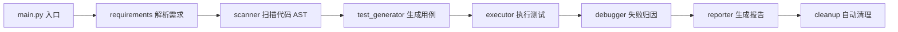

# AI 测试工程师 Agent

一个**根据「代码 + 需求文档」自动生成测试、跑测试、归因、产出 bug 单**的 AI Agent。
输入被测代码目录和 PRD，一条命令跑完整个测试流程，输出 Markdown 测试报告。

---

## 一、它能干什么

```
输入：被测代码目录 + 需求文档（PRD）
  ↓
输出：Markdown 测试报告（含确认的 bug 单：位置/严重度/期望/实际/复现步骤/建议修复）
```

示例（对 `../qa_ai_agent/backend` 测出 2 个 bug）：

```
$ .venv/bin/python main.py --target ../backend --prd docs/PRD.md --out report.md

[0] 清理旧环境 ...
[1/7] 启动被测后端 ...
[2/7] 解析需求规则 ...
[3/7] 扫描被测代码 ...
[4/7] 生成测试用例 ...
[5/7] 执行测试 ...
[6/7] 失败归因 ...
[7/7] 生成报告 ...
报告已生成: report.md
共发现 2 个 bug。
```

---

## 二、架构

核心思想：**确定性代码提供"事实"（扫描/执行/清理），LLM 负责"思考"（解析需求/设计用例/归因），且 LLM 失败时自动回退确定性代码。**



| 模块 | 职责 | 确定性/LLM |
|---|---|---|
| `core/models.py` | 数据契约（规则/用例/结果/bug单） | 确定性 |
| `core/requirements.py` | PRD → 规则表 | **LLM 优先** + 正则兜底 |
| `core/scanner.py` | AST 扫描接口/函数/调用关系 | 确定性 |
| `core/test_generator.py` | 规则 → 测试用例 → pytest 脚本 | **LLM 优先** + 模板兜底 |
| `service/executor.py` | 跑 pytest、起停服务、清理 | 确定性 |
| `core/debugger.py` | 失败归因 → bug 单 | **LLM 优先** + 规则兜底 |
| `core/reporter.py` | 渲染 Markdown 报告 | 确定性 |
| `main.py` | 编排整条流水线 | 确定性 |

### 分层原则

- **手（确定性代码）**：跑测试、拼脚本、起停服务、清理、AST 扫描 —— 不依赖 LLM。
- **脑（LLM）**：解析任意写法的需求、设计更聪明的用例、看懂失败原因 —— 输出必须过 schema 校验，失败回退。
- **兜底**：每个 LLM 模块都保留确定性版本，没配 key 或 LLM 出错时自动降级，流水线永不中断。

---

## 三、目录结构

```
test_ai_agent/
├── main.py               # 入口：编排整条流水线
├── docs/PRD.md           # 需求文档样例
├── .env.example          # LLM 配置模板
├── .venv/                # 虚拟环境（flask/flask-cors/requests/pytest/pyjwt）
├── core/
│   ├── models.py         # 数据契约
│   ├── requirements.py   # PRD → 规则（LLM + 正则兜底）
│   ├── scanner.py        # AST 扫描
│   ├── test_generator.py # 生成用例 + pytest 脚本（LLM + 模板兜底）
│   ├── debugger.py       # 失败归因（LLM + 规则兜底）
│   └── reporter.py       # 渲染 Markdown 报告
└── service/
    ├── executor.py       # 跑测试 / 起停服务 / 清理
    └── llm.py            # LLM 调用封装（chat / chat_json）
```

---

## 四、快速开始

### 1. 环境准备

```bash
# 创建虚拟环境并安装依赖
/opt/homebrew/bin/python3.12 -m venv .venv
.venv/bin/pip install flask flask-cors requests pytest pyjwt
```

### 2. 跑通（确定性版，无需 API key）

```bash
.venv/bin/python main.py --target ../backend --prd docs/PRD.md --out report.md
```

> 没配 `LLM_API_KEY` 时，所有 LLM 模块自动回退到确定性实现，功能照常。

### 3. 激活 AI 版（可选）

```bash
export LLM_API_KEY=sk-xxxx        # 你的密钥
# 可选：LLM_BASE_URL / LLM_MODEL（默认 DeepSeek，OpenAI 兼容地址均可）
.venv/bin/python main.py --target ../backend --prd docs/PRD.md --out report.md
```

### 4. 参数说明

| 参数 | 说明 | 默认 |
|---|---|---|
| `--target` | 被测代码目录（含 app.py） | 必填 |
| `--prd` | 需求文档路径（txt/md） | 必填 |
| `--out` | 报告输出路径 | `report.md` |
| `--port` | 被测服务端口 | `5000` |

---

## 五、流水线详解

| 步骤 | 做什么 | 产出 |
|---|---|---|
| 0 清理 | 释放端口、清旧测试库 | 干净环境 |
| 1 启动后端 | 起被测服务并等端口就绪 | 服务在线 |
| 2 解析需求 | PRD → `RequirementRule` 列表 | 规则表 |
| 3 扫描代码 | AST 找接口/函数/调用关系 | 接口+函数清单 |
| 4 生成用例 | 规则+接口 → `TestCase` → pytest 脚本 | 脚本 + 用例 |
| 5 执行测试 | 跑 pytest，解析每个用例 pass/fail | `TestResult` 列表 |
| 6 失败归因 | 判定真 bug/误报 → `BugReport` | bug 单 |
| 7 生成报告 | 渲染 Markdown，清理环境 | `report.md` |

---

## 六、数据契约（`core/models.py`）

| 类 | 含义 |
|---|---|
| `RequirementRule` | 一条需求规则（字段/描述/min_len/max_len/required/pattern） |
| `TestCase` | 一个测试用例（名称/规则/输入/期望状态码） |
| `TestResult` | 一条用例的执行结果（是否通过/输出/堆栈） |
| `BugReport` | 一张 bug 单（标题/位置/严重度/期望/实际/建议/复现步骤/证据） |

`Severity`：阻塞 / 严重 / 主要 / 次要 / 轻微。

---

## 七、LLM 升级模式

每个 LLM 模块遵循同一套模式：

```
确定性输入 → chat_json() → LLM 输出 JSON → schema 校验（_validate_rule/_validate_case/_validate_report）
   → 合法就采用
   → 不合法/失败 → 回退确定性实现
```

- `service/llm.py` 的 `chat_json()` 保证 LLM 返回可解析的 JSON，解析失败自动重试。
- LLM 输出一律由确定性代码做 schema 校验，坏项丢弃、坏批回退。

---

## 八、已知改进点

- 测试数据用**唯一用户名**（如时间戳后缀），避免重复跑时撞「已被注册」造成假通过。
- `scanner.py` 目前只做接口/函数级扫描，可扩展为读取函数源码喂给 LLM（归因更准）。
- `reporter.py` 可加错误分级汇总、修复后回归测试（re-test）。
